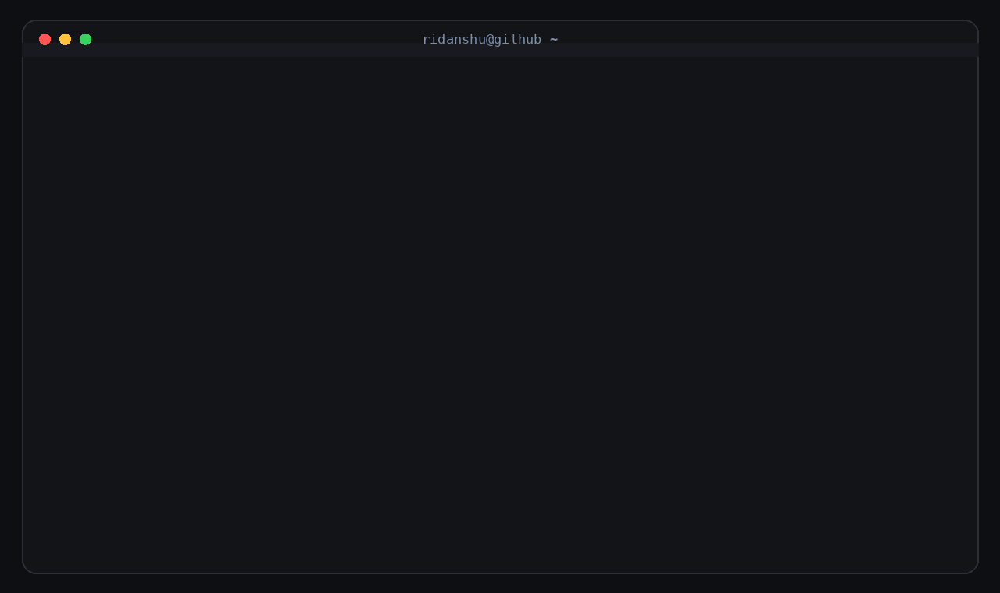

<!-- 

# RIDANSHU CHAUDHARY
### CSE Student | C++ DSA | MERN | Problem Solving

 -->
 

<!-- 

### Hi, I'm Ridanshu

I'm a Computer Science Engineering student focused on  
**problem solving, Data Structures & Algorithms, and software development.**

Currently working on:

**DSA with C++**  
**MERN Stack Development**  
**Building projects and improving every day** 

-->
 

&nbsp;

&nbsp;

 

## 🛠️ Tech Stack

### Languages

### Web Development

### Tools

<!--  

##  Currently Working On

- **Data Structures & Algorithms** — C++
- **MERN Stack Development**
- **LeetCode & Problem Solving**
- **Building and improving projects**

 

> *"The person who kept going wins — not the one who never fails."*

 -->

<!--  

## Currently Working On

  

**DSA & Problem Solving** &nbsp;&nbsp;&nbsp; **MERN Stack** &nbsp;&nbsp;&nbsp; **LeetCode**

"The person who kept going wins — not the one who never fails."*

 

 -->
 

## Currently Working On

<table>
<tr>
<td align="center">
 
<b>DSA</b>
</td>

<td align="center">
 
<b>MERN Stack</b>
</td>

<td align="center">
 
<b>LeetCode</b>
</td>
</tr>
</table>

 

## 📊 GitHub Stats

 

 

## Featured Projects

<table align="center">
<tr>

<td width="50%" align="center">

### Data Structures & Algorithms

C++ implementations of Data Structures, Algorithms,  
LeetCode problems, and problem-solving practice.

</td>

<td width="50%" align="center">

### MERN Stack

Projects built while learning and practicing  
MongoDB, Express, React, and Node.js.

</td>

</tr>
</table>
 

## Connect With Me

&nbsp;

&nbsp;

 

### Keep Learning. Keep Building. Keep Going.

